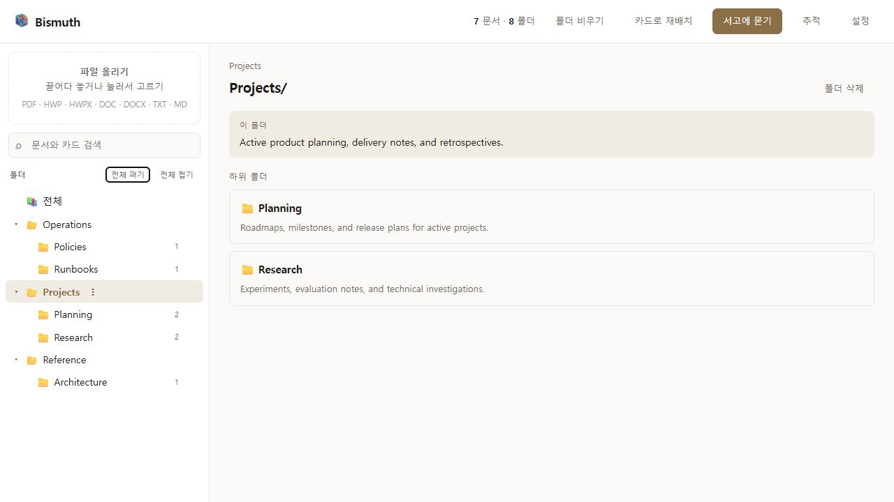

# Bismuth

<p align="center">
  <a href="./README.md"><kbd>English</kbd></a>
  <a href="./README.ko.md"><kbd>한국어</kbd></a>
</p>

<p align="center">
  <a href="https://github.com/Bismuth-AI/bismuth/actions/workflows/ci.yml"></a>
  
  <a href="LICENSE"></a>
</p>

**Drop in documents. Get a real folder structure an LLM agent can navigate.**

Bismuth reads documents, creates compact document cards, and organizes the originals
into an ordinary filesystem tree. As the collection grows, it reuses existing folders,
creates useful new branches, and revisits structure that no longer fits.

The result is not a proprietary database. It is a directory of original files,
searchable Markdown sidecars, and folder notes that remains usable without Bismuth.

> Bismuth aims for a practical, navigable library—not a perfect universal taxonomy.

> [!IMPORTANT]
> Bismuth is alpha software. The complete web upload flow supports PDF, HWP, HWPX, DOC,
> DOCX, TXT, and Markdown files only, and interfaces may change before 1.0.



<p align="center"><sub>A local Bismuth vault: ordinary folders on the left, their routing notes on the right.</sub></p>

## Why Bismuth?

Tool-using LLMs can inspect paths, list folders, grep text, and read only the documents
they need. That works best when the filesystem itself provides useful navigation clues.
A flat directory does not.

Bismuth turns an unstructured collection into an agent-readable library:

- folder names narrow the search space;
- `_folder.md` explains what belongs in each branch;
- `<original>.md` makes extracted content and document metadata grep-friendly;
- the original document remains the source of truth.

There is no fixed category tree and no corpus-specific few-shot taxonomy. The structure
is inferred from the documents in the vault and the tree that already exists.

### How it differs

| | Flat folders | Basic vector RAG | Bismuth |
| --- | --- | --- | --- |
| Primary retrieval signal | Filenames and manual browsing | Similarity-ranked text chunks | Paths, folder scopes, cards, and document text |
| Organizes the originals | No | No | Yes, through journaled moves |
| Agent navigation | Broad listing or full-text search | One top-k result set | Iterative `ls` → `grep` → `read` traversal |
| Human-readable without the service | Files remain readable, but unstructured | Source files remain; the index is separate | Yes: ordinary folders plus Markdown notes |
| Structure grows with the collection | Manual | The index updates; folder structure does not | Yes, with incremental filing and maintenance |
| Recovery and undo for file changes | Filesystem-dependent | Not applicable to source placement | Built-in transaction journal |

Bismuth is not a replacement for every RAG system. It creates a durable navigation
layer that humans and tool-using agents can inspect directly; vector or keyword search
can still be added on top when a workload benefits from it.

## How it works

1. An upload is validated and staged safely.
2. Bismuth parses the document and builds a structured card from its contents.
3. The card's title, type, topics, and substantive summary are compared with the current
   folder tree. Existing scopes are constraints, not a closed taxonomy, so a document may
   establish a new top-level branch when every current branch conflicts with its purpose.
4. Documents are filed in order so each decision can use the structure built so far.
5. As evidence accumulates, Bismuth groups loose files, reshapes overly broad branches,
   and settles files that remain at the root.
6. Filesystem changes are applied through a journaled transaction and reflected in
   folder notes and Markdown sidecars.

Documents are prepared concurrently for throughput, then filed in deterministic input
order. A saved card can also be reused to rebuild the tree without parsing the original
again.

## What the vault looks like

```text
my-vault/
├── _folder.md
├── Projects/
│   ├── _folder.md
│   ├── Planning/
│   │   ├── _folder.md
│   │   ├── roadmap.pdf
│   │   └── roadmap.pdf.md
│   └── Research/
│       └── ...
└── .bismuth/
```

- `_folder.md` describes a folder's scope and helps both placement and retrieval.
- `<original>.md` contains searchable extracted text and the document card.
- `.bismuth/` stores journals and runtime metadata. Do not edit or delete it manually.

Bismuth does not rewrite original file contents. It does move originals while organizing
the vault, so paths may change. Generated sidecars and folder notes are managed by
Bismuth.

## Features

- **Corpus-driven organization** — no predefined categories or domain-specific examples.
- **Growing folder structure** — reuses, creates, groups, and revisits branches as the
  collection changes.
- **Vault-wide card search** — finds documents by filename, current path, title, type,
  topic, or summary and links each result back to its folder.
- **Card-based rebuilds** — clears and rebuilds folder structure from saved cards without
  paying the parsing cost again.
- **Agentic retrieval** — the library agent inspects paths and folder notes before using
  `grep` and `read` on selected documents.
- **Reversible changes** — moves, deletions, and approved reorganizations are journaled;
  interrupted transactions are recovered on the next start and completed operations can
  be undone.
- **Provider choice** — Anthropic, OpenAI, and OpenAI-compatible endpoints such as Ollama,
  LM Studio, vLLM, or an internal gateway.
- **Separate answering model** — filing and question answering may use different model
  configurations.
- **Live progress and diagnostics** — the local web UI streams ingest progress and offers
  per-run model-call traces and spend information.

## Retrieval benchmark

We compared Bismuth's folder-aware agentic retrieval with an untuned basic vector RAG
baseline on the same Korean legal corpus, questions, `qwen3.6-35b` answer model, and
answer-only scorer. The corpus contained 300 documents (4,320 pages, 6.57 million
characters), and the benchmark contained 88 questions. The RAG baseline used 1,200-character chunks with
200-character overlap, BGE-M3 embeddings, cosine search, and a single top-k retrieval.

| Metric | Bismuth agentic | Basic RAG top-8 | Basic RAG top-20 |
| --- | ---: | ---: | ---: |
| Accuracy | **0.98** | 0.78 | 0.81 |
| Full-score questions | **81 / 88** | 53 / 88 | 52 / 88 |
| Zero-score questions | **0 / 88** | 9 / 88 | 3 / 88 |

The methods tied on direct single-fact questions. The largest observed gap was on
cross-law comparison (0.96 vs 0.59 / 0.56); version-sensitive and multi-document
questions also favored folder-aware traversal. In the paired 88-question comparison,
Bismuth minus RAG top-20 was +0.164 ± 0.028 (33 Bismuth wins, 1 RAG win).

See the public [protocol, category results, evidence-coverage analysis, and
limitations](BENCHMARK.md).

## Quick start

### Requirements

- Python 3.11 or newer
- A supported hosted model API, or an OpenAI-compatible local endpoint

Bismuth is currently installed from source:

```console
git clone https://github.com/Bismuth-AI/bismuth.git
cd bismuth
python -m venv .venv
```

Activate the environment:

```bash
# macOS / Linux
source .venv/bin/activate

# Windows PowerShell
.venv\Scripts\Activate.ps1
```

Install and launch:

```console
python -m pip install ".[all]"
bismuth
```

Bismuth opens `http://127.0.0.1:8765` by default. On first launch, the browser setup asks
for:

- the vault directory;
- the model provider and model;
- an API key, or the URL of an OpenAI-compatible endpoint.

Useful launch options:

```console
bismuth --vault ./my-vault
bismuth --port 9000
bismuth --no-open
bismuth --help
```

### Five-minute walkthrough

1. **Choose a vault and model.** Start `bismuth`, then complete the local setup screen.
   Use a new or backed-up directory while evaluating alpha software.
2. **Upload a representative first batch.** Mix several document types and topics so
   the initial branches reflect the collection instead of one narrow subject.
3. **Inspect the proposed library.** Expand the tree and read each folder's scope note.
   Originals remain next to their generated `.md` sidecars.
4. **Find and ask.** Use card search for a known document, or choose **Ask the library**
   for a question that requires the agent to traverse several folders and cite evidence.
5. **Grow or repair the structure.** Add more files incrementally, move a misplaced
   document manually, rebuild from saved cards, or undo a journaled change.

For a quick smoke test, start with a handful of TXT or Markdown files whose correct
grouping you already know. Confirm the paths and folder notes before trying a large or
sensitive collection.

Settings are stored in `~/.bismuth/config.json`. For environment-based configuration,
copy [`.env.example`](.env.example) to `.env` and use the documented `BISMUTH_*`
variables.

## Model backends

The setup screen supports:

- Anthropic;
- OpenAI;
- OpenAI-compatible servers, including Ollama, LM Studio, vLLM, and internal gateways.

The default local endpoint example is `http://localhost:11434/v1`. Organization quality
depends on the model's instruction following, structured-output reliability, and context
window. Quality on small local models has not yet been benchmarked systematically.

Document text is sent to the model endpoint you configure. Choose and operate that
endpoint according to your privacy requirements.

Provider credentials are stored locally in `~/.bismuth/config.json`, not in an operating
system keychain. The file is created with user-only permissions where the platform
supports them.

### Model disclosure and independent operation

Bismuth does not contain or train model weights. It uses an existing model unchanged,
and the model is selected and operated by the user. The open-weight reference deployment
used for full-pipeline verification is
[`Qwen/Qwen3.8-27B-FP8`](https://huggingface.co/Qwen/Qwen3.8-27B-FP8), published under
Apache-2.0. Anthropic and OpenAI are optional hosted providers, not runtime requirements.

For independent operation, serve the reference model with an OpenAI-compatible server
such as vLLM:

```console
vllm serve Qwen/Qwen3.8-27B-FP8 --port 8000
```

Then select **OpenAI-compatible server** in Bismuth, set the endpoint to
`http://127.0.0.1:8000/v1`, and enter `Qwen/Qwen3.8-27B-FP8` as the model. The model
proposes semantic decisions; Bismuth's own source code parses documents, validates
schemas and paths, applies journaled filesystem transactions, and supports recovery and
undo. The product is therefore not limited to forwarding a hosted model response.

See [`THIRD_PARTY_NOTICES.md`](THIRD_PARTY_NOTICES.md) for model, library, framework,
and tool sources and licenses. CI also publishes the exact resolved transitive license
inventory for every commit.

## Current scope

Supported in the complete product flow:

- PDF, HWP, HWPX, DOC, DOCX, TXT, and Markdown upload and text extraction;
- up to 500 files per request, 50 MB per file, and 500 MB total;
- document cards, Markdown sidecars, and folder notes;
- incremental organization and card-based full refiling;
- manual move and delete with journal-backed undo;
- folder-aware question answering;
- per-run LLM diagnostics and usage accounting.

Not currently supported:

- OCR for scanned PDFs;
- authenticated deployment on an external network;
- background scheduled organization;
- an MCP server;
- guaranteed organization quality on small local models.

Parser adapters for additional formats exist in the codebase, but those formats are not
yet supported by the complete upload and analysis flow.

## Architecture

Bismuth uses ports and adapters. Dependency direction is enforced by Ruff rules.

```text
domain/       Value objects and pure rules
ports/        Protocols required by the application
services/     Ingest, filing, maintenance, retrieval, and transactions
adapters/     LLM, filesystem, parser, catalog, and journal implementations
prompts/      Structured, corpus-neutral model instructions
agentkit/     Internal provider-neutral tool-calling agent loop
api/          FastAPI application and local web UI
cli/          Local web application launcher
container.py  Composition root
```

Tests inject scripted models and temporary vaults, so core organization, recovery, and
API behavior can be verified without an API key.

## Data safety and diagnostics

Every filesystem mutation is journaled before it is applied. If a process stops during a
transaction, Bismuth detects the incomplete entry and rolls it back on the next start.

Diagnostics are written to `./logs/`. Per-run records under `./logs/runs/<run_id>/` are
not deleted automatically. They may contain extracted document text, prompts, model
inputs, and model outputs. Review and redact them before sharing a bug report. The logs
directory is ignored by Git.

The web application has no authentication and intentionally binds only to a loopback
address. Do not expose it directly to an external network.

## Development

```console
python -m pip install -e ".[all,dev]"
ruff check src tests
ruff format --check src tests
mypy
pytest -q
```

See [`CONTRIBUTING.md`](CONTRIBUTING.md) for contribution guidelines and
[`CHANGELOG.md`](CHANGELOG.md) for release history.

## License

Bismuth is available under the [Apache License 2.0](LICENSE). See [`NOTICE`](NOTICE) for
the copyright notice and [`THIRD_PARTY_NOTICES.md`](THIRD_PARTY_NOTICES.md) for software
and model attribution.
